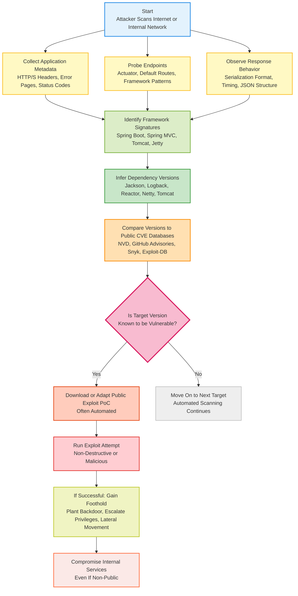

```mermaid
flowchart TD
    A[Start<br/>Attacker Scans Internet or Internal Network]:::start

    A --> B[Collect Application Metadata<br/>HTTP/S Headers, Error Pages, Status Codes]:::collect
    A --> C[Probe Endpoints<br/>Actuator, Default Routes, Framework Patterns]:::collect
    A --> D[Observe Response Behavior<br/>Serialization Format, Timing, JSON Structure]:::collect

    B --> E[Identify Framework Signatures<br/>Spring Boot, Spring MVC, Tomcat, Jetty]:::identify
    C --> E
    D --> E

    E --> F[Infer Dependency Versions<br/>Jackson, Logback, Reactor, Netty, Tomcat]:::infer

    F --> G[Compare Versions to Public CVE Databases<br/>NVD, GitHub Advisories, Snyk, Exploit-DB]:::compare

    G --> H{Is Target Version<br/>Known to be Vulnerable?}:::decision

    H -->|Yes| I[Download or Adapt Public Exploit PoC<br/>Often Automated]:::exploitprep
    H -->|No| J[Move On to Next Target<br/>Automated Scanning Continues]:::skipped

    I --> K[Run Exploit Attempt<br/>Non-Destructive or Malicious]:::attack
    K --> L[If Successful: Gain Foothold<br/>Plant Backdoor, Escalate Privileges, Lateral Movement]:::post
    L --> M[Compromise Internal Services<br/>Even If Non-Public]:::impact

    %% Styles
    classDef start fill:#e3f2fd,stroke:#1e88e5,stroke-width:2px;
    classDef collect fill:#fff9c4,stroke:#fbc02d,stroke-width:2px;
    classDef identify fill:#dcedc8,stroke:#7cb342,stroke-width:2px;
    classDef infer fill:#c8e6c9,stroke:#43a047,stroke-width:2px;
    classDef compare fill:#ffe0b2,stroke:#fb8c00,stroke-width:2px;
    classDef decision fill:#f8bbd0,stroke:#d81b60,stroke-width:3px;
    classDef exploitprep fill:#ffccbc,stroke:#e64a19,stroke-width:2px;
    classDef attack fill:#ffcdd2,stroke:#e53935,stroke-width:2px;
    classDef post fill:#f0f4c3,stroke:#c0ca33,stroke-width:2px;
    classDef impact fill:#fbe9e7,stroke:#ff7043,stroke-width:2px;
    classDef skipped fill:#eeeeee,stroke:#9e9e9e,stroke-width:1px;

```
